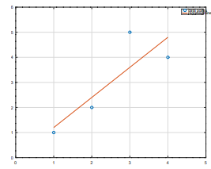

**Лабораторная работа 2**

**Научное программирование**

**Выполнил: Чепыгов Евгений**

Цель работы: Изучить базовые аспекты функционала программы Octave, научиться
считать от простейших примеров, до матричных и векторных выражений с постройкой
графиков, которые можно редактировать и дополнять.

Ход выполнения работы:

1. Скачал Octave и начал проводить операции с матрицами

2. Находил определитель с рангом матрицы

3. Начал учиться строить графики по заданным данным

4. А также строить график прямой и график из точек на одной плоскости

5. Ввел визуальные показатели графика по типу – легенды, осей, названия

6. Используя tic и toc замерил эффективность работы

Вывод: Я изучил основной функционал программы Octave, научиться считать
матричные и векторные выражения с постройкой графиков.
